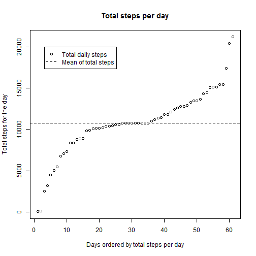

## Loading and preprocessing the data
Start by extracting the data from the zip file, loading the uncompressed csv and converting the
date and interval columns from text to an actual date.

```r
library(lubridate)
unzip("activity.zip")
data <- read.csv("activity.csv", header=TRUE)
data$interval <- sapply(data$interval, function(t){h<-floor(t/100);m<-t%%100;paste(h,m,sep=":")})
data$timestamp <- ymd_hm(paste(data$date, data$interval, sep=" "))
data$interval <- data$date <- NULL
```

A random sample of the cleaned data looks like this:

```r
data[sort(sample.int(nrow(data),5)),]
```

```
##       steps           timestamp
## 1705      0 2012-10-06 22:00:00
## 2135     NA 2012-10-08 09:50:00
## 10286    57 2012-11-05 17:05:00
## 15624     6 2012-11-24 05:55:00
## 16441     0 2012-11-27 02:00:00
```

## What is mean total number of steps taken per day?

Compute the total number of steps taken each day (ignoring NA values) using ddply to group by date and then adding all step counts.

```r
library(plyr)
totalStepsPerDay <- ddply(data, .(format(timestamp, "%Y-%m-%d")), 
                          function(x){sum(x$steps, na.rm=true)})
names(totalStepsPerDay) <- c("date", "total.steps")
```

Below is a histogram that shows the frequency of the daily number of steps.
We can see that for more than a quarter of the days the subject took 10k to 12k steps.
Additionally we can see there are 10 days that had 0 to 2000 setps:

```r
hist(totalStepsPerDay$total.steps, xlab="Total daily steps", ylab="Frequency", 
     main="Histogram of daily step frequencies", breaks=10)
```

 

Finally let's look at the mean and medium for the total daily steps.

```r
meanTotalStepsPerDay <- mean(totalStepsPerDay$total.steps)
meanTotalStepsPerDay
```

```
## [1] 9354.23
```


```r
medianTotalStepsPerDay <- median(totalStepsPerDay$total.steps)
medianTotalStepsPerDay
```

```
## [1] 10395
```

The mean total steps per day is 9,354
and the median total steps per day is 10,395.

## What is the average daily activity pattern?

Here is a time series plot of the average number of steps taken within a time interval over all
days in the data. Start by computing the average per interval using ddply then plot the data.

```r
meanStepsPerInterval <- ddply(data, .(format(timestamp, "%H:%M")), 
                              function(x){mean(x$steps, na.rm=TRUE)})
names(meanStepsPerInterval) <- c("time.interval", "mean.steps")

plot(seq_along(meanStepsPerInterval$time.interval), 
     meanStepsPerInterval$mean.steps, 
     xlab="Time interval", ylab="Average steps taken at interval", 
     type="l", xaxt='n')
title("Mean steps per time interval for all data")
axis(side=1, 
     at=which(minute(hm(meanStepsPerInterval$time.interval))==0), 
     labels=meanStepsPerInterval$time.interval[minute(hm(meanStepsPerInterval$time.interval))==0])
```

 


```r
highestMeanStepsInterval <- meanStepsPerInterval[meanStepsPerInterval$mean.steps==max(meanStepsPerInterval$mean.steps),]
highestMeanStepsInterval
```

```
##     time.interval mean.steps
## 104         08:35   206.1698
```
From the plot we can see that the interval with the highest average across all days is 
08:35 
with 206.17 steps.


## Imputing missing values


```r
missingValues <- sum(is.na(data$steps))
missingValues
```

```
## [1] 2304
```

There are 2304 records with missing values that can bias the results above.
To adjust for this bias we will replace missing values with mean value over all the non-NA records
of the same 5 minute interval.


```r
# copy data
data.adjusted <- data

# add merge key and merge
data.adjusted$key = format(data.adjusted$timestamp,"%H:%M")
data.adjusted <- merge(data.adjusted, meanStepsPerInterval, by.x="key", by.y="time.interval")

# replace na values with mean for the same interval
data.adjusted[is.na(data.adjusted$steps),]$steps <- data.adjusted[is.na(data.adjusted$steps),]$mean.steps

# clean and order the data
data.adjusted$key <- data.adjusted$mean.steps <- NULL
data.adjusted <- data.adjusted[order(data.adjusted$timestamp),]
```

We can see the the new data replaces the na values with the mean values for the same intervals.
The original data looked like this:

```r
head(data)
```

```
##   steps           timestamp
## 1    NA 2012-10-01 00:00:00
## 2    NA 2012-10-01 00:05:00
## 3    NA 2012-10-01 00:10:00
## 4    NA 2012-10-01 00:15:00
## 5    NA 2012-10-01 00:20:00
## 6    NA 2012-10-01 00:25:00
```

The new data looks like this:

```r
head(data.adjusted)
```

```
##         steps           timestamp
## 1   1.7169811 2012-10-01 00:00:00
## 63  0.3396226 2012-10-01 00:05:00
## 128 0.1320755 2012-10-01 00:10:00
## 205 0.1509434 2012-10-01 00:15:00
## 264 0.0754717 2012-10-01 00:20:00
## 327 2.0943396 2012-10-01 00:25:00
```

Where the mean intervals look like this (which matches the above values):

```r
head(meanStepsPerInterval)
```

```
##   time.interval mean.steps
## 1         00:00  1.7169811
## 2         00:05  0.3396226
## 3         00:10  0.1320755
## 4         00:15  0.1509434
## 5         00:20  0.0754717
## 6         00:25  2.0943396
```

Now that we have removed the NA values let's look at the distribution of total steps per day again:

```r
# colapse the data by day and sum
totalStepsPerDay.adjusted <- ddply(data.adjusted, .(format(timestamp, "%Y-%m-%d")), 
                                   function(x){sum(x$steps, na.rm=true)})
names(totalStepsPerDay.adjusted) <- c("date", "total.steps")

# plot data
hist(totalStepsPerDay.adjusted$total.steps, xlab="Total daily steps", ylab="Frequency", 
     main="Histogram of daily step frequencies (with NA values replaced)", breaks=10)
```

 

We can see that the number of days with a total of 0 to 2,000 steps has reduced from 10 days to
only 2 days.

Finally let's look at the adjusted mean and medium for the total daily steps.

```r
meanTotalStepsPerDay.adjusted <- mean(totalStepsPerDay.adjusted$total.steps)
meanTotalStepsPerDay.adjusted
```

```
## [1] 10766.19
```


```r
medianTotalStepsPerDay.adjusted <- median(totalStepsPerDay.adjusted$total.steps)
medianTotalStepsPerDay.adjusted
```

```
## [1] 10766.19
```

The mean total steps per day is
10,766
and the median total steps per day is
10,766.
As expected both show an increase over the non-adjusted data where the NA values effectively count
as zero for that day.

Interestingly the mean and median have the same value because there were some days that were
composed entirely of NA values.
These days had all steps values substitued with the mean for each interval.
It so happens that the median total steps is also one of the days that is replaced by all mean
values.
The results is that the mean and medium share the same value.
This can be shown by plotting the sorted daily totals as follows:

```r
plot(sort(totalStepsPerDay.adjusted$total.steps), 
     type="p", 
     xlab="Days ordered by total steps per day", 
     ylab="Total steps for the day")
abline(h=mean(totalStepsPerDay.adjusted$total.steps), lty=2)
legend(x=3, y=20000, c("Total daily steps", "Mean of total steps"), 
       pch=c(1,NA), lty=c(NA,2))
title("Total steps per day")
```

 

## Are there differences in activity patterns between weekdays and weekends?

Now we will compare steps taken on the weekend with steps taken on a weekday.
Start by assigning a new factor variable to the data indicating if the data point is a weekend or
a weekday.


```r
data.adjusted$day.type <- factor(
  weekdays(data.adjusted$timestamp,abbreviate=TRUE) %in% c("Sun","Sat"), 
  levels=c(FALSE,TRUE), 
  labels=c("weekday","weekend"))
```

Here is what a sample of the data looks like now:

```r
data.adjusted[sort(sample.int(nrow(data.adjusted),5)),]
```

```
##          steps           timestamp day.type
## 16877 0.000000 2012-10-15 23:00:00  weekday
## 9985  0.000000 2012-10-25 13:35:00  weekday
## 8174  5.000000 2012-10-28 11:05:00  weekend
## 8406  0.000000 2012-11-07 11:25:00  weekday
## 16066 2.622642 2012-11-14 21:55:00  weekday
```

Plot a time series of the intervals and average number of steps taken across weekdays and weekends:

```r
# compute mean steps per interval for the weekdays
meanStepsPerInterval.weekday <- ddply(data.adjusted[data.adjusted$day.type=="weekday",], 
                                      .(format(timestamp, "%H:%M")), 
                                      function(x){mean(x$steps)})
names(meanStepsPerInterval.weekday) <- c("time.interval", "mean.steps")
meanStepsPerInterval.weekday$time.interval <- factor(meanStepsPerInterval.weekday$time.interval)
meanStepsPerInterval.weekday$day.type <- "weekday"

# compute mean steps per interval for the weekends
meanStepsPerInterval.weekend <- ddply(data.adjusted[data.adjusted$day.type=="weekend",], 
                                      .(format(timestamp, "%H:%M")), 
                                      function(x){mean(x$steps)})
names(meanStepsPerInterval.weekend) <- c("time.interval", "mean.steps")
meanStepsPerInterval.weekend$time.interval <- factor(meanStepsPerInterval.weekend$time.interval)
meanStepsPerInterval.weekend$day.type <- "weekend"

# merge data
meanStepsPerInterval.all <- rbind(meanStepsPerInterval.weekday,meanStepsPerInterval.weekend)

# create a vector of indexes at which we will place x-axis labels
label.pos <- seq(from=1, to=length(meanStepsPerInterval.weekday$time.interval), by=30)

# plot the data partitioned by day-type
library(lattice)
xyplot(mean.steps ~ time.interval | day.type, meanStepsPerInterval.all, 
       grid=TRUE, layout=c(1,2), type="l", 
       ylab="Mean steps per day", xlab="Time interval",
       main="Mean steps per interval comparison: Weekday vs Weekend",
       scales=list(
         x=list(
           at=label.pos, labels=meanStepsPerInterval.weekday$time.interval[label.pos])))
```

 

The plot shows that weekdays have a large number of steps in the early morning around 9am followed
by limited motion throughout the day with some spikes late in the day (perhaps after work).
However on weekends steps are more more evenly distributed throughout the day.
